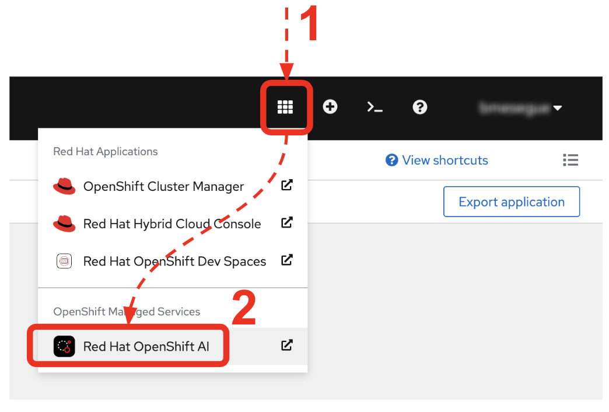
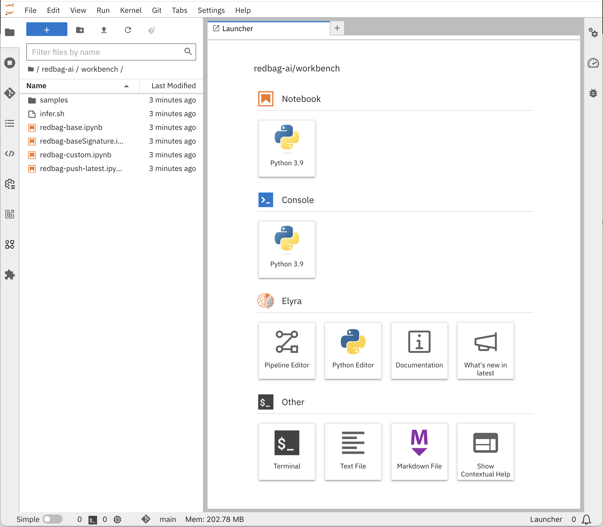

:walkthrough: Lab Introduction
:user-password: openshift
:namespace: {user-username}

:experimental:

:article-url: https://developers.redhat.com/articles/2023/08/15/some-article-url

// :btn-text: my text
// :btn: pass:attributes[<code><mark style="background-color: dodgerblue; color: white">&nbsp;{btn-text}&nbsp;</mark>]

ifdef::env-github[]
endif::[]

[id='lab-intro']
= AI basics - Lab1

Explore, build, test and deploy a Camel X demo application using the Developer Sandbox and OpenShift Dev Spaces.

Start your AI journey by learning the very basics of creating, deploying, and invoking a model.

This hands-on lab is based on the following blog article in Red Hat Developers:

* link:{article-url}[window="_blank", , id="rhd-source-article"]

{empty} +

Assuming you have followed the article's instructions, you should be all set to get hands-on with the basics of AI to build applications in the _OpenShift Dev Spaces_ workspace.

For illustration purposes, the picture below shows what the integration end-to-end flow looks like.

// image::images/00-demo-end2end.png[align="center", width=80%]

A client invokes an OpenApi service. A _Camel_ route attends the call, translates the JSON input into XML and calls a backend service to obtain an XML response, then it's translated back to JSON before responding to the original service call.

{empty} +

[time=1]
[id="section-one"]
== Create an AI workbench

Let's first start by opening Red Hat OpenShift AI in the Developer Sandbox.

To open the _OpenShift_ console, from _VS Code_ follow the actions below, as illustrated:

. Copy the command below:
+
[source,bash,subs=]
----
> Dev Spaces: Open OpenShift Console
----
. From VS Code, click the search bar at the top of the window.
. Paste the command:
- Linux: kbd:[Ctrl+v] and press kbd:[Enter] 
- Mac: kbd:[⌘+v] and press kbd:[Enter]
. When prompted, click the button `pass:[<mark style="background-color: dodgerblue; color: white">Open</mark>]` 
+

+
{blank}
. Make sure the console is in _Developer_ view, and you see the _Topology_.
+

{empty} +

From the OpenShift console:

. click the apps icon at the top of the screen
. select Red Hat OpenShift AI
+

// reset counter

. From OpenShift AI, select on the left menu _Data Science Projects_
// . In your project's row, click on the link "[blue]#Create a workbench#"
. In your project's row, click on the link pass:["Create a workbench"]

+

{empty} +

Now, enter the following field values to create your AI workbench.

- Name: `lab-wb`
- Notebook image -> Image selection: `TensorFlow`
- Deployment size -> Container size: `Medium`
+
[NOTE]
Leave all other fields with their default values

Then, click at the bottom the `pass:[<mark style="background-color: dodgerblue; color: white">Create workbench</mark>]`

{empty} +

---

{blank}

Your workbench will start provisioning.
It's status will transition from:

- Starting... -> ✓ Running
+
{blank}

// - pass:[Starting...] -> pass:[✓ Running]
// +
// {blank}

Once in `✓ Running` state,

. Click pass:[Open] to launch the workbench in _JupyterLab_.
+

+
{empty} +

. Log in with...
+
[square]
* pass:[&nbsp; DevSandbox &nbsp;]
+
{empty} +

. Accept the **Authorize Access** options:
+
--
[none]
* ☑ user:info
* ☑ user:check-access
--
+
{blank}
+
And click the `Allow selected permissions` button.

{empty} +

---

{blank}

JupyterLab will open in a new tab.

Clone the source code repository following the actions below:

. Click the _Git Clone_ button
. Copy & paste the repository below:
+
[source,subs=]
----
https://github.com/brunoNetId/redbag-ai
----
+
{blank}
. Click the `pass:[<mark style="background-color: dodgerblue; color: white">&nbsp;Clone&nbsp;</mark>]` button
+

{empty} +

After the project is cloned, make sure you change to the following directory in your project tree:

📁 `/redbag-ai/workbench`

{empty} +

You should see in your browser a window similar to:

{empty} +

[type=verification]
Do you have JupyterLab open and your source code cloned from GitHub?

[type=verificationSuccess]
You're good to continue with the next step.

[type=verificationFail]
Review the instructions and try to spot where you might have deviated.

{empty} +

[time=3]
[id="section-two"]
== Run your first AI prediction

In this section of the tutorial you'll run, from _JupyterLab_, a _Notebook_ containing code which loads an AI model and runs an inference (prediction) against it.

But first, it's important to get familiar with the base model you will be working with. Continue reading below for a quick overview of the model.

{empty} +

=== Introduction to MobileNet V2

The base model used in the code, _MobileNetV2_, is a well known CNN (_Convolutional Neural Network_), very efficient for image classification tasks.

The model is composed of a series of layers, it takes an image as an input, and produces a probabilistic distribution as an output. +
The inner workings of the model are better understood if summarised in two main stages:

. *Feature extraction*
+
For a given image input, the model extracts features (information) such as color, texture, edges, corners, shapes.

. *Classification*
+
Series of neuronal network layers the information from the extraction traverses and results in a distribution of probabilities.

{empty} +

You can find both stages, feature extractions and classification, in the diagram below, describing in more detail the end to end process.

The feature extraction concentrates in synthesising the image into a flat structure of data fed into the classification phase. It's the trained neuronal network that computes the probabilities of matching the input with its dictionary of possible choices.

{empty} +

=== Execute the Notebook

At this point you should have your JupyterLab environment open. Let's run your your first inference.

From the project explorer on the left hand side of your window, double-click on the following resource (notebook):

* redbag-ai -> workbench -> `**redbag-base.ipynb**`

{blank}

Explore the code inside the notebook. +
In summary, the code implements the following logic:

. Loads a pre-trained model.
. Tests a single image (banana).
. Saves the base model to disk.

{empty} +

The code is essentially using a banana image to infer the model and display the prediction result.

To execute all the code at once, use the menu and select:

* *Run* -> *Run All Cells*
+
[NOTE]
--
The upper right corner shows a progress wheel. Wait until finished (idle state):

--
+
{blank}

Your JupyterLab environment will run all the code and render the output of all executed cells.

The most notable parts of the execution are:

. The input image is converted into a _Tensor_, a multi-dimensional array, before it can be handed over to the model to infer it.

. The inference output is also given as a _Tensor_, and looks similar to:
+
----
1/1 [==============================] - 1s 804ms/step
[[2.15310047e-05 1.42507633e-05 3.33830462e-06 7.00388591e-06
  1.16191713e-05 3.88226545e-05 1.25413470e-04 6.46742546e-06
  1.66206009e-05 3.67777284e-05 2.33631945e-05 1.30055469e-05
  ...            ...            ...            ...
  8.52387075e-06 1.84521323e-05 2.47112821e-05 5.01178838e-05
  9.12087944e-06 1.34241609e-05 7.77729929e-06 7.68292466e-06
  3.32153577e-05 3.97006515e-05 1.97341960e-05 1.06714460e-05]]
----
+
{blank}

. The highest Tensor value is extracted and matched to the `banana` label

. The model is persisted to disk (to be used in the next chapter).

{empty} +

=== Chapter conclusions

Executing a prediction was cool, but note how the illustration below highlights the _Tensor_ data that goes in and out of the model: 

The illustration below highlights the _Tensor_ data that goes in and out of the model: 

{empty} +

For the process above to happen, the developer requires to convert the image into _Tensor_ data, and also to handle _Tensor_ output data before understanding the result.

It's rather inconvenient for traditional developers having to deep dive into the _Tensor_ world in order to build their AI powered applications.

In the next chapter you'll learn a strategy to encapsulate the complexity of handling _Tensors_ so that developers can integrate with an interface easy to talk to.

{empty} +
 
[type=verification]
Did you see the execution predict the `banana` label?

[type=verificationSuccess]
You're ready to jump to the next chapter !!

[type=verificationFail]
Inspect in the cell outputs to investigate the possible causes of failure.

[time=2]
[id="section-three"]
== Define a model interface

The previous chapter hinted that it's not easy for developers to use models as they are required to learn and use _Tensors_.

A good strategy is to apply "separation of concerns". Let the developer focus on implementing the application, hide AI complexity, and make the model easy to consume.

The diagram below shows the approach that simplifies the way developers can integrate AI capabilities to their applications.

Compared to the diagram shown in the previous chapter, the one above shows a much easier interface to work with.

. The model input is *Base64*
. The model output is a *String*
+
{blank}

Developers can easily deal with the types above. Converting an image to Base64 is very easy, and obtaining a plain String as a result is a walk in the park.

{empty} +

=== Create a TensorFlow Signature

In _TensorFlow_, "signatures" are the interface contracts to define input/output specifications.

From the project explorer on the left hand side of your window, double-click on the following resource (notebook):

* redbag-ai -> workbench -> `**redbag-baseSignature.ipynb**`

{blank}

Explore the code inside the notebook. +
In summary, the code implements the following logic:

. Loads the model from disk (saved in the previous chapter)
. Defines the model _Signature_ (and saves the new model)
. Test single image (banana)

{empty} +

The key part is the _Signature_ definition:

{blank}

The signature is essentially encapsulating what previously the developer was responsible of, that is:

. Converting the image into _Tensor_ information
. Running the prediction
. Processing the result to obtain the label tag

{empty} +

Now, run the notebook by selecting from the menu:

* *Run* -> *Run All Cells*
+
[NOTE]
--
The upper right corner shows a progress wheel. Wait until finished (idle state):

--
+
{blank}

When done, inspect the last output cell of your notebook. It should show the following result:

[subs="verbatim,quotes"]
----
{'output_0': <tf.Tensor: shape=(2,), dtype=string, numpy=array([b'*banana*', b'*0.975945*'], dtype=object)>}
----

[NOTE]
The signature has post-processed the result and converted the output tensor data, from 1000 probability values, to just the highest one and its matching label (banana, 0.975945)

{empty} +

[type=verification]
Did your execution predict a banana?

[type=verificationSuccess]
Well done, you're ready to deploy this model !!

[type=verificationFail]
Inspect in the cell outputs to investigate the possible causes of failure.

[time=3]
[id="section-four"]
== Deploy and test the model

The previous task showed how to encapsulate tensor complexity and expose instead and easy to consume interface.

Next, you will complete the encapsulation by deploying the model in a Model Server. Below you have a list of some clear benefits:

- Model servers manage different models, versions and hot-deploys.
- Model servers can scale as needed to respond to demand.
- Separation of concerns is preserved by separating applications from 
inferencing.

The next set of actions will help you to:

. Setup S3 storage and push our model.
. Deploy a Model Server.
. Run an inference against our model.

{empty} +

=== Setup S3 storage

You will operate from VS Code in _DevSpaces_ to deploy what's needed.

Switch back to your DevSpaces tab in your browser.

You can inspect the YAML source you will deploy if you open in your editor the following file:

* deploy -> `**minio.yaml**` 
+
{blank}

The definition contains everything needed to deploy and access the Minio (S3) service.

. Open a terminal from DevSpaces:
+

+
{blank}

. Execute the following command:
+
[source,console]
----
oc apply -f deploy/minio.yaml 
----
+
{blank}
+
You should see the following output:
+
----
persistentvolumeclaim/lab-minio-pvc created
secret/lab-minio-secret created
deployment.apps/lab-minio created
service/lab-minio-service created
route.route.openshift.io/lab-r2-minio-api created
route.route.openshift.io/lab-r1-minio-ui created
----

{empty} +

Now, from your OpenShift console's _Topology_ view, find Minio's deployment.

[NOTE]
--
If you don't have the _OpenShift_ console open in a browser tab, click the search bar on top and use the command and actions from the picture below:

--

You need to create an S3 bucket. +
Use Minio's UI to do so, follow the instructions below.

. Click on the deployment's link (blue circle)
. Enter in _Minio_ the credentials `**minio**`/`**minio123**`.
. Click on the `pass:[<mark style="background-color: navy; color: white">&nbsp;Login&nbsp;</mark>]` button
. Click on the link pass:[Create a Bucket]
. Enter `**production**` as the bucket name
. Click the button `pass:[<mark style="background-color: navy; color: white">&nbsp;Create Bucket&nbsp;</mark>]`
+
{blank}

{empty} +

Now that your S3 bucket is ready, you can push your model into the bucket.

{empty} +

=== Push model to S3

Switch to your JupyterLab environment.

Find and open the following Notebook definition:

* redbag-ai -> workbench -> `**redbag-push-latest.ipynb**`

{blank}

The notebook contains code to read the model from your workbench (saved in earlier tasks), and pushes it to the S3 bucket you just created.

Execute the code by selecting from the menu:

* *Run* -> *Run All Cells*
+
[NOTE]
--
The upper right corner shows a progress wheel. Wait until finished (idle state):

--
+
{blank}

The last cell output should show the following logs:

[subs="verbatim,quotes"]
----
models/*redbag*/*1*/fingerprint.pb
models/*redbag*/*1*/saved_model.pb
models/*redbag*/*1*/variables/variables.index
models/*redbag*/*1*/variables/variables.data-00000-of-00001
---- 

{blank}

The logs show:

- the model is composed of 4 artifacts
- the model's name is *redbag*
- The version uploaded is *1*.

{empty} +

=== Deploy the Model Server

The next step is to deploy the model server.

[NOTE]
We choose to use a _TensorFlow Model Server_ because its interface allows sending Base64 images in JSON fields.

Switch to your _DevSpaces_ tab in your browser.

Inspect the following YAML source in your VS Code editor:

* deploy -> `**tensorflow.yaml**` 
+
{blank}

The definition contains everything needed to deploy the _TensorFlow Model Server_.

. From your terminal, execute the following command:
+
[source,console]
----
oc apply -f deploy/tensorflow.yaml 
----
+
{blank}
+
You should see the following output:
+
----
persistentvolumeclaim/lab-minio-pvc created
secret/lab-minio-secret created
deployment.apps/lab-minio created
service/lab-minio-service created
route.route.openshift.io/lab-r2-minio-api created
route.route.openshift.io/lab-r1-minio-ui created
----

{empty} +

{empty} +

The stub acts as the backend service that provides the XML data we need to fetch.

{empty} +

. Test the stub
+
Copy/paste the following cURL command to obtain a response from the stub:
+
[source, subs=]
----
curl -s \
-H "content-type: application/xml" \
-d '' \
http://end1:8080/camel/subscriber/details \
| bat -pP -lxml 
----
+
NOTE: The cURL command above now points to the newly deployed pod, with its service `end1` listening on port 8080.
+
NOTE: The command also includes a pipe to colorise the XML output for better reading.

{empty} +

[type=verification]
Did you obtain the same XML message as shown above?

[type=verificationSuccess]
You've successfully tested the stub deployed in the sandbox !!

[type=verificationFail]
Inspect in the stub logs to investigate possible causes of failure.

[time=4]
[id="section-five"]
== Deploy and test the main service

With the stub already deployed, we just need to deploy the service which will integrate with the stub running under the same namespace.

{empty} +

. Deploy the service
+
Ensure you run the commands below from the terminal located in the path of your main service project.
+
You can now copy and paste the following command in your terminal to trigger the deployment:
+
[source, subs=]
----
mvn oc:deploy -Popenshift -s configuration/settings.xml 
----

{empty} +

[type=verification]
Did you obtain the same JSON response as shown above?

[type=verificationSuccess]
You've successfully invoked the simple service as an external client !!

[type=verificationFail]
Inspect in the stub logs to investigate possible causes of failure.

{empty} +

[time=1]
[id="section-six"]
== Clean up your namespace

When you're done playing in the _Developer Sandbox_, you can clean up your Sandbox namespace by un-deploying your Camel `simple` service and stub `end1` using the following _Maven_ `oc:undeploy` command for both:

[source, subs=]
----
mvn oc:undeploy -Popenshift -s configuration/settings.xml 
----

{blank}

Executing the command above for both services should leave your topology view clean from routes, services, and other Kubernetes artifacts in your namespace.

{empty} +

[type=verification]
Is your namespace clean from artifacts?

[type=verificationSuccess]
You've successfully cleaned up your namespace !!

[type=verificationFail]
Inspect in the stub logs to investigate possible causes of failure.

{empty} +
