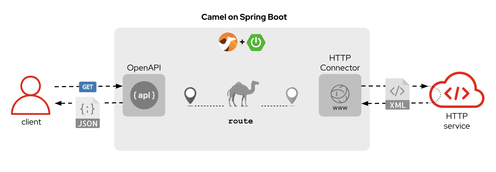

:walkthrough: Lab Introduction
:user-password: openshift
:namespace: {user-username}

:experimental:

:article-url: https://developers.redhat.com/articles/2023/08/15/some-article-url

ifdef::env-github[]
endif::[]

[id='lab-intro']
= Camel X - Lab1

Explore, build, test and deploy a Camel X demo application using the Developer Sandbox and OpenShift Dev Spaces.

This hands-on lab is based on the following blog article in Red Hat Developers:

* link:{article-url}[window="_blank", , id="rhd-source-article"]

{empty} +

Assuming you have followed the article's instructions, you should be all set to get hands-on with _Camel X_ in the _OpenShift Dev Spaces_ workspace.

For illustration purposes, the picture below shows what the integration end-to-end flow looks like.

A client invokes an OpenApi service. A _Camel_ route attends the call, translates the JSON input into XML and calls a backend service to obtain an XML response, then it's translated back to JSON before responding to the original service call.

{empty} +

[time=1]
[id="section-one"]
== Explore the source code

The _Camel_ source file `api-simple.xml` defines the entire end-to-end processing logic, which you can find in your project explorer under the path:

--
* `some/path/camel/api-simple.xml`
--

{empty} +

[time=3]
[id="section-two"]
== Run the stub in your terminal

The stub acts as the backend service that provides the XML data we need to fetch.

. Let's first run the stub
+
Copy and paste the following command in your terminal to place yourself in the stub's Camel Spring Boot project:
+
[source, subs=]
----
cd camelsb/stubs/end1 
----
+
{blank}
+
Then, copy/paste the following command to start the stub in the terminal:
+
[source, subs=]
----
mvn -Dspring-boot.run.profiles=dev -s configuration/settings.xml 
----
+
{blank}
+
{empty} +
+
Copy/paste the following cURL command to obtain a response from the stub:
+
[source, subs=]
----
curl -s \
-H "content-type: application/xml" \
-d '' \
http://localhost:9000/camel/subscriber/details \
| bat -pP -lxml 
----

{empty} +

[type=verification]
Did you obtain the same XML message as shown above?

[type=verificationSuccess]
You've successfully tested the stub !!

[type=verificationFail]
Inspect in the stub logs to investigate the possible causes of failure.

[time=2]
[id="section-three"]
== Run the service in your terminal

The main _Camel_ service exposes a JSON REST API and integrates with the XML backend service (the stub).

{empty} +

. Run the main service
+
Copy and paste the following command in your terminal to place yourself in the main Camel Spring Boot project:
+
[source, subs=]
----
cd /projects/devsandbox-camel/camelsb/level1simple/ 
----
+
{blank}
+
Then, copy/paste the following command to start the stub in the terminal:
+
[source, subs=]
----
mvn -Dspring-boot.run.profiles=dev -s configuration/settings.xml 
----

{empty} +

[type=verification]
Did you obtain the same JSON response as the one shown above?

[type=verificationSuccess]
You've successfully tested the main service !!

[type=verificationFail]
Inspect in the stub logs to investigate possible causes of failure.

[time=3]
[id="section-four"]
== Deploy and test the stub

The stub acts as the backend service that provides the XML data we need to fetch.

{empty} +

. Test the stub
+
Copy/paste the following cURL command to obtain a response from the stub:
+
[source, subs=]
----
curl -s \
-H "content-type: application/xml" \
-d '' \
http://end1:8080/camel/subscriber/details \
| bat -pP -lxml 
----
+
NOTE: The cURL command above now points to the newly deployed pod, with its service `end1` listening on port 8080.
+
NOTE: The command also includes a pipe to colorise the XML output for better reading.

{empty} +

[type=verification]
Did you obtain the same XML message as shown above?

[type=verificationSuccess]
You've successfully tested the stub deployed in the sandbox !!

[type=verificationFail]
Inspect in the stub logs to investigate possible causes of failure.

[time=4]
[id="section-five"]
== Deploy and test the main service

With the stub already deployed, we just need to deploy the service which will integrate with the stub running under the same namespace.

{empty} +

. Deploy the service
+
Ensure you run the commands below from the terminal located in the path of your main service project.
+
You can now copy and paste the following command in your terminal to trigger the deployment:
+
[source, subs=]
----
mvn oc:deploy -Popenshift -s configuration/settings.xml 
----

{empty} +

[type=verification]
Did you obtain the same JSON response as shown above?

[type=verificationSuccess]
You've successfully invoked the simple service as an external client !!

[type=verificationFail]
Inspect in the stub logs to investigate possible causes of failure.

{empty} +

[time=1]
[id="section-six"]
== Clean up your namespace

When you're done playing in the _Developer Sandbox_, you can clean up your Sandbox namespace by un-deploying your Camel `simple` service and stub `end1` using the following _Maven_ `oc:undeploy` command for both:

[source, subs=]
----
mvn oc:undeploy -Popenshift -s configuration/settings.xml 
----

{blank}

Executing the command above for both services should leave your topology view clean from routes, services, and other Kubernetes artifacts in your namespace.

{empty} +

[type=verification]
Is your namespace clean from artifacts?

[type=verificationSuccess]
You've successfully cleaned up your namespace !!

[type=verificationFail]
Inspect in the stub logs to investigate possible causes of failure.

{empty} +
